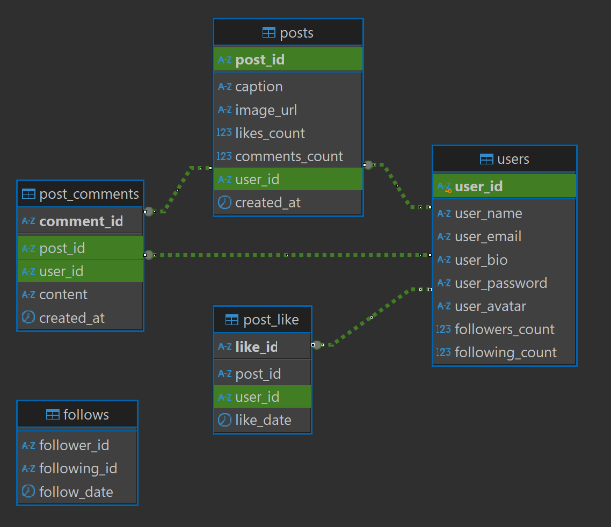

# social-app
Simple backend for android app

## stack
- ktor
- postgresql
- exposed
- DI koin
- hikari
- kotlinx.serialization
- authentication JWT



## routing
### auth routes
- `POST /signup`
  ```
  body raw json:
  {
     "user_name": "Example Name",
     "user_email": "test@test.com",
     "user_password": "example_password"
  }
  ```
- `POST /signin`
  ```
  body raw json:
  {
     "user_email": "test@test.com",
     "user_password": "example_password"
  }
  ```

### user routes
auth type: Bearer Token
- `GET /user?email=`
- `GET /user/{user_id}?current_user_id=`
- `POST /user/update`
  ```
  body form-data
  user_date: Text -> 
  {
     "user_id": "531210e0-faaf-4823-a653-3f2a14c084e5",
     "name": "Name",
     "bio": "Some text",
     "avatar": null
  }
  image: File
  ```

### follows routes
auth type: Bearer Token
- `POST /follows/follow`
  ```
  body raw json:
  {
     "follower": "68d48f90-1ee2-424b-8463-2ddf7e8e76b5",
     "following": "ebe5c631-76fd-44bf-b7fd-ba00ab7e80a8"
  }
  ```
- `POST /follows/unfollow`
  ```
  body raw json:
  {
     "follower": "68d48f90-1ee2-424b-8463-2ddf7e8e76b5",
     "following": "ebe5c631-76fd-44bf-b7fd-ba00ab7e80a8"
  }
  ```
- `GET /follows/followers?user_id=&page=&page_size=`
- `GET /follows/following?user_id=&page=&page_size=`
- `GET /follows/suggestions?user_id=`

### posts routes
auth type: Bearer Token
- `POST /post/create`
  ```
  body form-data
  post_data: Text -> 
  {
     "user_id": "5b2ce8a3-c9ce-4767-98ef-f642666c41a7",
     "caption": "Some test text"
  }
  image: File
  ```
- `GET /post/{post_id}?user_id=`
- `DELETE /post/{post_id}`
- `GET /posts/feed?user_id=&page=&page_size=`
- `GET /posts/{posts_owner_id}?user_id=&page=&page_size=`

### post comments routes
auth type: Bearer Token
- `POST /post/comments/create`
  ```
  body raw json:
  {
     "post_id": "43b3db5b-1548-49e8-b8a6-fe9ff6220f83",
     "user_id": "68d48f90-1ee2-424b-8463-2ddf7e8e76b5",
     "content": "Some contents text"
  }
  ```
- `DELETE /post/comments/delete/{comment_id}?user_id=&post_id=`
- `GET /post/comments/{post_id}?page=&page_size=`

### post likes routes
auth type: Bearer Token
- `POST /post/likes/add`
  ```
  body raw json:
  {
     "post_id": "43b3db5b-1548-49e8-b8a6-fe9ff6220f83",
     "user_id": "ebe5c631-76fd-44bf-b7fd-ba00ab7e80a8"
  }
  ```
- `POST /post/likes/remove`
  ```
  body raw json:
  {
     "post_id": "43b3db5b-1548-49e8-b8a6-fe9ff6220f83",
     "user_id": "ebe5c631-76fd-44bf-b7fd-ba00ab7e80a8"
  }
  ```
